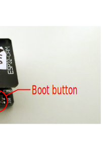

## Face Recognition with AI Thinker ESP32-CAM

The goal of this project is to provide low cost face recognition for a home automation system.  
AI Thinker ESP32-CAM hardware is quite affordable and therefore suitable for low budget projects. For face recognition the Espressif esp-who library is used.  
The multifunction (boot) button can be used to enroll or delete a face. This functionality can also be controlled via the cam command topic.  
If an enrolled face is recognized, the cam LED flashes. Via Mqtt the ID of the recognized face is published.
The camera can be integrated into a home automation system (via Mqtt) and thus indicate the presence of known persons or the presence of unknown persons.
For better privacy protection video streaming over the network is not used.
Because the cam uses a low power ESP32 microprocessor, power consumption during face recognition phase is only about 1 Watt.

### Enrolling a face

Look into the camera and press and hold the boot button for about 3 seconds.The face params together with a Face ID are stored in flash memory.

### Removing  a Face ID

Press the boot button twice briefly. The last saved Face ID will be removed.

### Transmitting the Face ID via Mqtt

If a face is recognized, the camera publishes the Face ID (a positive int value) to the face recognition topic. If an unknown face is detected, the camera will report this with an ID of -1.

### Configuration

The following parameters need to be configured via the menuconfig functionality of the ESP32 SDK. Some parameters have default values.

Wifi hostname: ESP_HOST_NAME
Wifi SSID: ESP_WIFI_SSID
Wifi password: ESP_WIFI_PASSWORD  
Mqtt host url: MQTT_HOST  
Face recognition topic name: MQTT_TOPIC_RECOGNITION
Camera command topic name: MQTT_TOPIC_COMMAND

### ESP32-CAM-MB Module

The boot button is connected to GPIO0 and GND.
### Usage example

In my personal setup the home automation system openHAB executes the following rules:
If a person is not recognized, the person is asked to face the camera (for audio I use a Google Nest).
If the person does not comply or is unknown to the system, an alarm is triggered.
If a face is recognized the system marks this person as present.
If no ID is published for some time the person is marked as absent.
